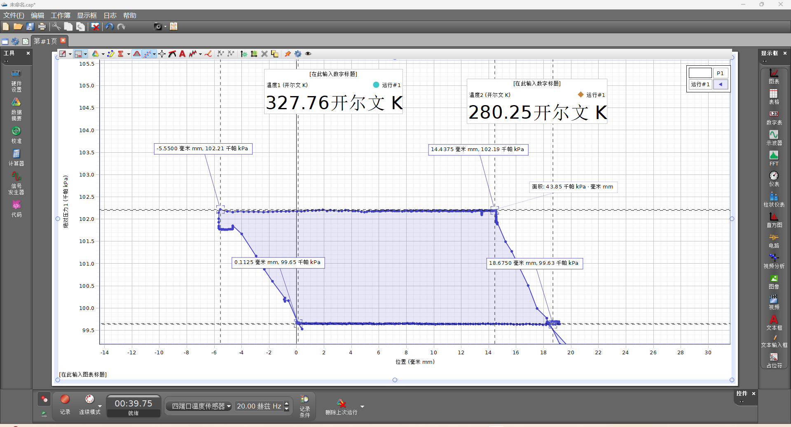
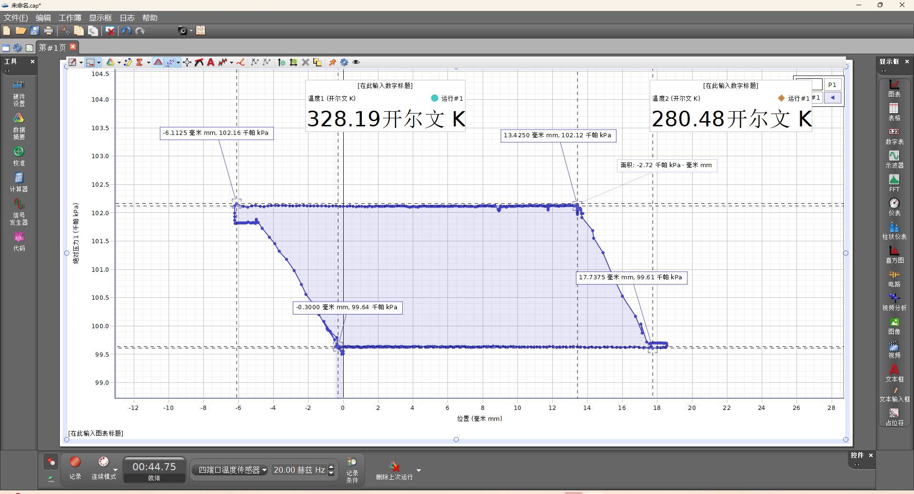
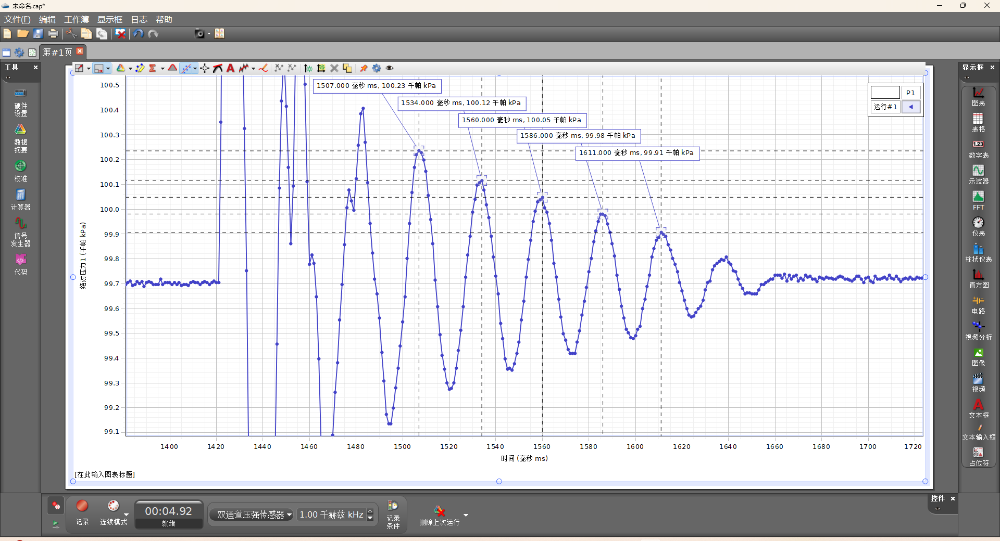
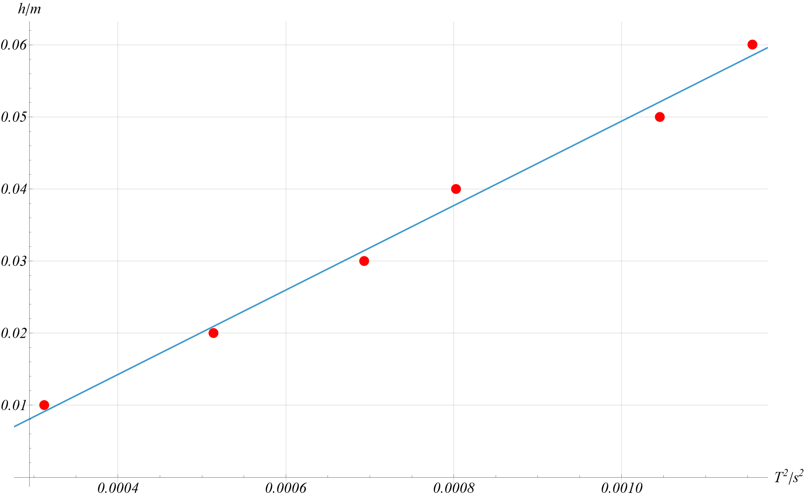

# 热机循环实验

## 五、数据处理

### 1. 热机循环实验

<figure>
	
    <figcaption>
热机循环-1
</figcaption>
</figure>

<figure>
	
    <figcaption>
热机循环-2
</figcaption>
</figure>

### 2. 测量空气的比热容比

<figure>
	
    <figcaption>
周期测量
</figcaption>
</figure>

<figure>
	
    <figcaption>
直线拟合
</figcaption>
</figure>