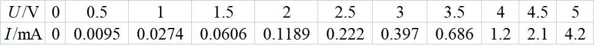
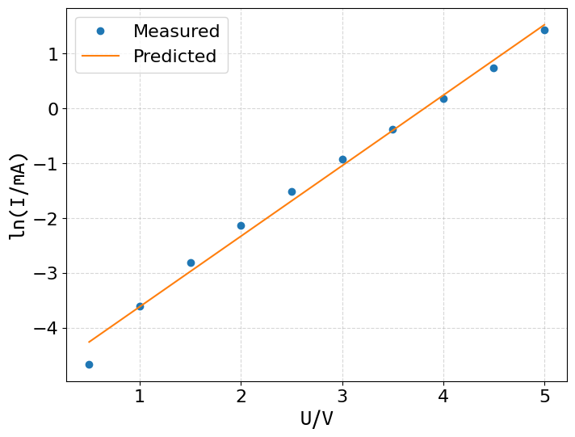
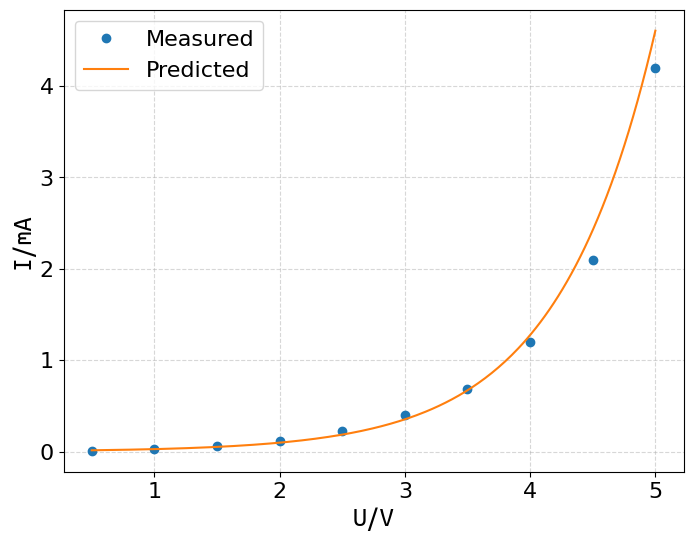
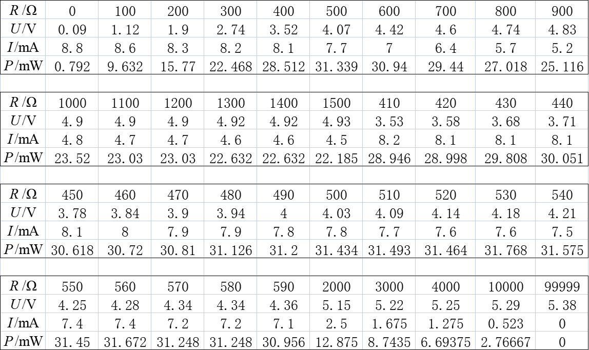
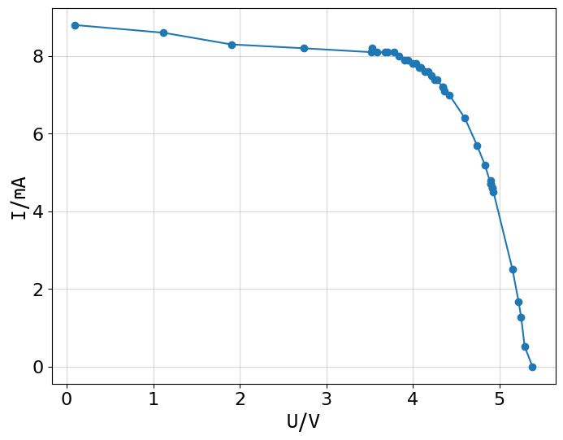
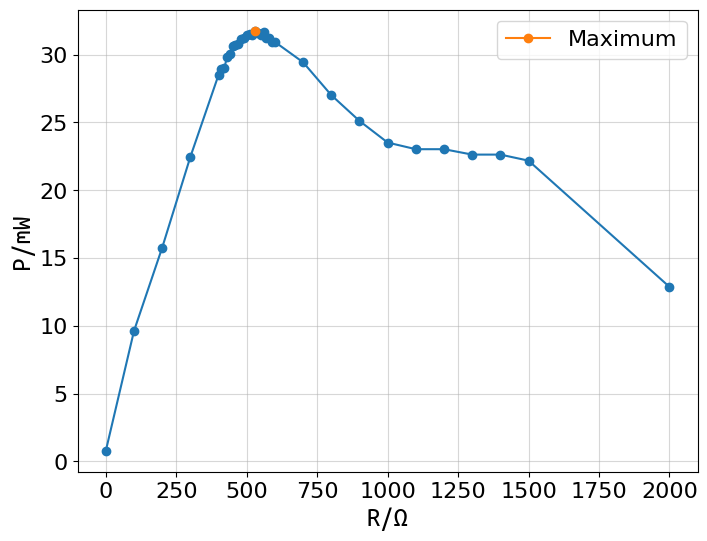

# 太阳能电池实验

## 五、实验数据

### 1. 在无光源条件下，测量硅光电池正向偏压时的伏安特性

对于$\ln I=\beta U+\ln I_0$，代入数据，由最小二乘法可得
$$
\beta\approx1.284436\ \mathrm{V^{-1}}\\
I_0\approx\exp(-4.895502)\ \mathrm{mA}\approx7.48\ \mathrm{\mu A}
$$
计算得决定系数
$$
R^2\approx0.991030
$$
可见模型拟合得极好。

### 3. 测量太阳能电池板的负载特性

最佳匹配电阻
$$
R_\mathrm e\approx530\ \ohm
$$
最大输出功率
$$
P_\mathrm m\approx31.768\ \mathrm{mW}
$$
由开路电压$U_\mathrm{OC}=5.38\ \mathrm V$和短路电流$I_\mathrm{SC}=8.8\ \mathrm{mA}$可得填充因子
$$
FF=\frac{P_\mathrm m}{U_\mathrm{OC}I_\mathrm{SC}}\approx0.671
$$
